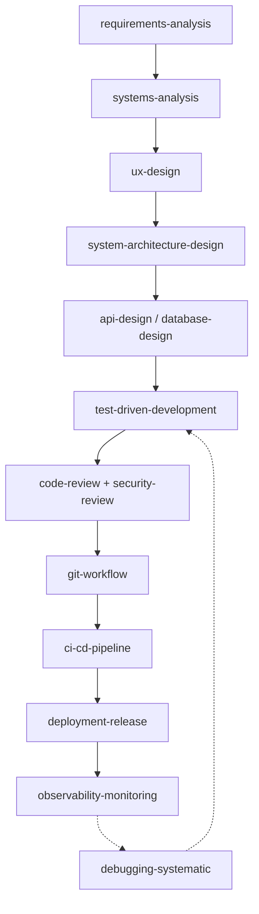

# Skills — Ciclo de Vida de Desenvolvimento de Software

Este diretório contém uma coleção de **skills** (no formato `SKILL.md`, compatível com
GitHub Copilot / agentes de IA) cobrindo as etapas do ciclo de vida de desenvolvimento
de software para este projeto (API NestJS + Web Angular).

Cada skill é carregada sob demanda pelo agente quando a descrição (`description`) do
front-matter YAML corresponde ao contexto da tarefa atual. Mantenha as descrições
ricas em palavras-chave para facilitar a descoberta automática.

## Etapas cobertas

| Fase | Skill | Quando usar |
|------|-------|-------------|
| 1. Descoberta | [requirements-analysis](./requirements-analysis/SKILL.md) | Levantar/esclarecer requisitos antes de codificar |
| 2. Design | [systems-analysis](./systems-analysis/SKILL.md) | Analista de Sistemas: regras de negócio, processos e entidades |
| 2. Design | [ux-design](./ux-design/SKILL.md) | UX Designer: fluxos de usuário, telas, usabilidade e escolha de componentes Taiga UI |
| 2. Design | [system-architecture-design](./system-architecture-design/SKILL.md) | Definir arquitetura, módulos e ADRs |
| 2. Design | [api-design](./api-design/SKILL.md) | Desenhar endpoints REST, DTOs e contratos |
| 2. Design | [database-design](./database-design/SKILL.md) | Modelar entidades, relações e migrações |
| 3. Implementação | [test-driven-development](./test-driven-development/SKILL.md) | TDD, testes unitários/e2e (Jest) |
| 3. Implementação | [refactoring](./refactoring/SKILL.md) | Refatorar com segurança sem quebrar comportamento |
| 4. Qualidade | [code-review](./code-review/SKILL.md) | Revisar PRs e diffs antes do merge |
| 4. Qualidade | [security-review](./security-review/SKILL.md) | Auditoria de segurança (OWASP Top 10) |
| 4. Qualidade | [performance-optimization](./performance-optimization/SKILL.md) | Diagnosticar e corrigir gargalos de performance |
| 5. Depuração | [debugging-systematic](./debugging-systematic/SKILL.md) | Investigar bugs com evidências, não suposições |
| 6. Entrega | [git-workflow](./git-workflow/SKILL.md) | Branches, commits (Conventional Commits) e PRs |
| 6. Entrega | [ci-cd-pipeline](./ci-cd-pipeline/SKILL.md) | Pipelines de build/lint/test/deploy |
| 6. Entrega | [deployment-release](./deployment-release/SKILL.md) | Releases, Docker/nginx/SSL, versionamento |
| 7. Operação | [observability-monitoring](./observability-monitoring/SKILL.md) | Logs, métricas e health checks |
| 8. Manutenção | [technical-documentation](./technical-documentation/SKILL.md) | Documentação técnica clara e enxuta |
| 8. Manutenção | [dependency-management](./dependency-management/SKILL.md) | Adicionar/atualizar/auditar dependências npm |

## Fluxo típico

## Boas práticas adotadas nestas skills

- **Descrições ricas em gatilhos**: cada `description` usa o padrão "Use when: ..."
  com palavras-chave específicas para permitir descoberta automática pelo agente.
- **Carregamento progressivo**: cada `SKILL.md` é autocontido e enxuto (menos de ~100
  linhas), evitando o "carregamento monolítico" que desperdiça contexto.
- **Escopo único por skill**: cada arquivo cobre uma responsabilidade clara do ciclo
  de desenvolvimento, evitando sobreposição.
- **Ancoradas no repositório real**: exemplos e convenções fazem referência à
  estrutura real (`api/src/modules/**`, `web/src/app/**`, `docs/`, `docker-compose*`),
  para que as recomendações sejam imediatamente acionáveis neste projeto.
- **Checklists e anti-padrões**: cada skill inclui uma seção de "Common Pitfalls"
  para orientar o agente sobre erros frequentes a evitar.

## Adicionando uma nova skill

1. Crie uma pasta `skills/<nome-da-skill>/SKILL.md`.
2. Preencha o front-matter com `name` (igual ao nome da pasta) e `description`
   (com gatilhos claros de "quando usar").
3. Estruture o corpo com: When to Use → Procedure → Best Practices → Common Pitfalls.
4. Se a skill precisar de scripts/templates, adicione em subpastas `scripts/`,
   `references/` ou `assets/` dentro da pasta da skill.
